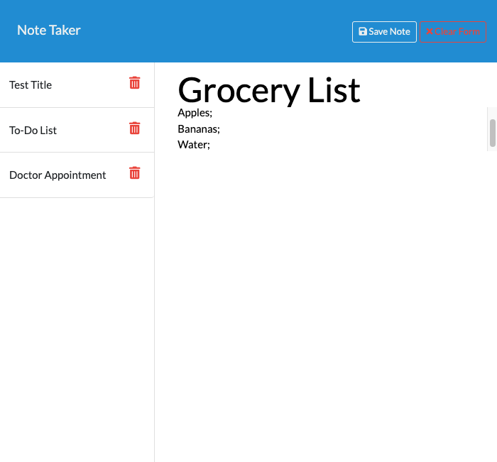
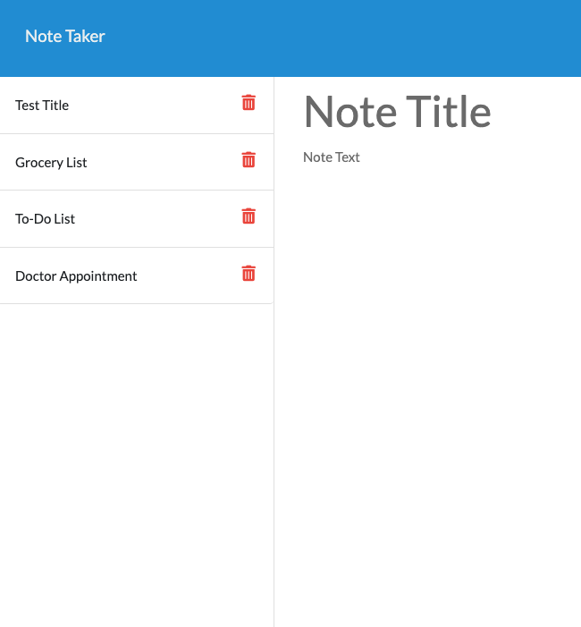

# My Notes 

Explore, Think and Take NOTES! 

## Description 

This is a simple Note Taker application that helps users to add, save and delete notes. 

User Story; 

My Deployed Application;

 

 

## Summary 

This application is a basic Note Taker application which is operated with Express.js and will save and retrieve data from JSON.
The application will allow the user to add note's title and description. Also the user will be able to save the notes so won't lose them even they refresh the page. There is a delete button as well so the user can delete the notes which are not needed anymore!

## Features 

Used 'Express.js' to build server

Used 'fs(File System)' module to read and write from 'db.json' file.

Used uuid npm package to give unique id to each note.

Application is deployed on heroku : Heroku is a container-based cloud Platform as a Service (PaaS). Developers use Heroku to deploy, manage, and scale modern apps.

## Installation / Usage 

Clone this repository to use this application on local machine.

To install necessary dependencies, run the following command :

npm i

The application will be invoked with the following command: This will start localhost server on PORT 3000.

node server.js

Open browser and type http://localhost:3000/ to run this application on your local machine.

## License 

MIT License

## Deployment Link 

https://my-notes-dlknrdn-071c24fcedc9.herokuapp.com/notes 

## Author 
Dilek Nuredin

https://github.com/dileknrdn 